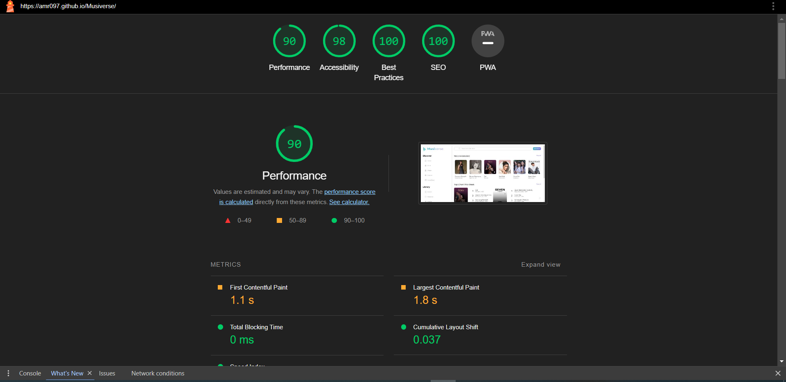

<h3 align="center">
   Musik App Template
</h3>

<p align="center"></p>

<p align="center">
  

  

  

  

</p>

<p align="center">
  <a href="#-about-the-project">About The Project</a>&nbsp;&nbsp;&nbsp;|&nbsp;&nbsp;&nbsp;
  <a href="#-technologies">Technologies</a>&nbsp;&nbsp;&nbsp;|&nbsp;&nbsp;&nbsp;
  <a href="#-getting-started">Getting Started</a>
  
</p>

<p align="center">
  <button><a href="https://amr097.github.io/Musiverse/"></img></a></button>

## 🚀 Technologies

- [HTML5]()
- [Scss]()
- [Figma]()

## 📜 About the project

- This project is a translation of [Musiverse Figma design](<https://www.figma.com/file/JnZ5MODBo3wSx4og1eRsVJ/Web-App-Music-Player---UI-KIT-(Community)?node-id=302%3A3580&mode=dev>) to a responsive static website using HTML5 and SCSS.

- Responsive & Attractive for all screen sizes.

- Implemented smooth animations & effects to enhance user experience.

- Followed SEO best practices and achieved a perfect 100 SEO score on Lighthouse.

- Followed Accessibility best practices and achieved a 98 accessibility score on Lighthouse.

- Clean, well-structured and easy to modify / maintain code.

- Used BEM methodology for organizing and naming CSS classes.

- Used Container queries & Media queries for responsiveness.

## 🕯️ Lighthouse Score

</img>

## 🐢 Getting started

### Requirements

- [Node.js](https://nodejs.org/en/)
- [Yarn](https://classic.yarnpkg.com/) or [npm](https://www.npmjs.com/)

**Clone the project and access the folder**

```bash
$ git clone https://github.com/Amr097/e-commerce-shop.git

$ cd Musiverse

```

**Follow the steps below**

```bash

Copy and paste index.html path to your browser.


```
